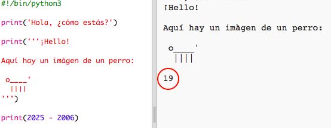
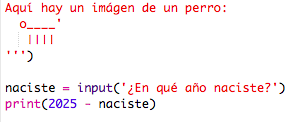

## El año 2025

También podrás realizar cálculos e imprimir números. Comprobemos que edad tendrás en el año 2025.

+ Para calcular los años que tendrás en el año 2025 necesitas restar a 2025 el año en el que naciste.

    Añade este código a tu programa:

    

    Ten en cuenta que no necesitas poner comillas en los números.

    (Deberás cambiar el número `2006` si naciste en otro año).

+ Haz clic en 'run' y tu programa imprimirá la edad que tendrás en el año 2025.

    

+ Podrás mejorar tu programa usando `input()` para preguntar al usuario su edad y almacenarla en una __variable__ denominada `born`.

    

+ Ejecuta tu programa y, a continuación, introduce el año en el que naciste. ¿Has recibido otro mensaje de error?

    Esto se debe a que todo lo escrito en tu programa es __texto__ y necesita ser convertido a __números__.

    Usa `int()` para convertir el texto en un  __número entero__.

    

+ También podrás crear otra variable para almacenar tus cálculos e imprimirlos.

    

+ Por último, podrás facilitar la comprensión de tu programa añadiendo un mensaje práctico.

    

